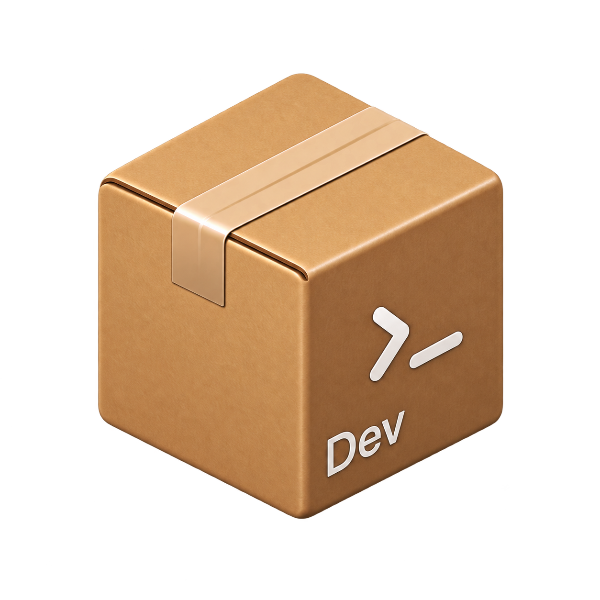

# bondar

<p align="center">
  
</p>

<p align="center">
  <a href="https://github.com/iqbqioza/bondar/actions/workflows/ci.yml"></a>
  <a href="https://github.com/iqbqioza/bondar/actions/workflows/release.yml"></a>
</p>

> [!NOTE]
> This project is under active development and may contain bugs or unexpected behavior. We apologize for any inconvenience.

A standalone development container command, as an alternative to the [Dev Container CLI (@devcontainers/cli)](https://github.com/devcontainers/cli).

**Fun fact: "bondar" is an anagram of "danboru" (段ボール), the Japanese word for a cardboard box. It's basically a box — a pretty neat name, right?**

- No dependency on Node.js, VSCode Server, or other Microsoft-related tools (single Rust binary)
- Uses existing `.devcontainer/devcontainer.json` definitions as-is
- Requires only the Docker CLI
- Works on Linux, macOS and Windows (host requirements use platform-appropriate probes; UID/GID sync is skipped on Windows)

## Install

```sh
# Install the latest release binary (no sudo required)
curl -fsSL https://raw.githubusercontent.com/iqbqioza/bondar/main/install.sh | sh
```

Windows (PowerShell, no admin required):

```powershell
powershell -ExecutionPolicy Bypass -File install.ps1
```

Or build from source:

```sh
cargo build --release
# add target/release/bondar to your PATH
```

## Commands

```sh
# Build the image
bondar build --workspace-folder ./sample
bondar build --workspace-folder ./sample --no-cache

# Create and start the container
bondar up --workspace-folder ./sample
bondar up --workspace-folder ./sample --no-cache --remove-existing-container

# Stop and remove
bondar down --workspace-folder ./sample

# Run a command / interactive shell
bondar exec --workspace-folder ./sample -- ls -la
bondar shell --workspace-folder ./sample

# Logs / configuration validation
bondar logs --workspace-folder ./sample --tail 100 --follow
bondar read-configuration --workspace-folder ./sample
bondar read-configuration --workspace-folder ./sample --include-merged-configuration
```

## Feature support

| Feature | Status |
|---|---|
| `image` / `build` / `dockerComposeFile` | Supported |
| Lifecycle scripts (`initializeCommand` etc., 6 types) | Supported (String/Array/Object, background execution via `waitFor`) |
| `containerEnv` / `remoteEnv` / `secrets` | Supported (`${localEnv:}` / `${containerEnv:}` / `${devcontainerId}` expansion; secrets use `{"KEY": {"localEnv": "VAR"}}` form - the file path string form is warned and skipped) |
| `features` / `overrideFeatureInstallOrder` | Supported (`oras`/`docker pull` -> `docker cp` -> `install.sh`) |
| `mounts` / `workspaceMount` / `forwardPorts` / `appPort` | Supported (`docker run` and compose override.yml injection, incl. port ranges and IPv6 `[addr]:port`) |
| `hostRequirements` / `updateRemoteUserUID` | Supported (warnings, `usermod`/`groupmod`/`chown`/`useradd`) |
| `userEnvProbe` | Supported (probe results applied to lifecycle) |
| `portsAttributes` / `otherPortsAttributes` | Supported (stored as container labels) |
| `shutdownAction` / `waitFor` | Supported |
| `read-configuration` | Strict validation against the official JSON Schema |
| `customizations` | Intentionally unsupported (VSCode independence) |

## Design

- `src/cli.rs` - command line definitions
- `src/config.rs` - devcontainer.json parser (JSONC support) + bundled official schema
- `src/docker.rs` - Docker CLI wrapper (build/run/exec/ps/logs)
- `src/compose.rs` - Docker Compose support + dynamic override.yml generation
- `src/lifecycle.rs` - lifecycle script execution (sync/async)
- `src/features.rs` - OCI fetch, transfer, and execution of Features
- `src/host.rs` - host requirement checks, UID/GID sync
- `src/command/` - subcommand implementations

## Development

```sh
cargo fmt
cargo clippy
cargo test
```

A verification workspace is available under `sample/`. Note that
`sample/.devcontainer/devcontainer.json` sets `remoteUser: "vscode"`; when that
user is not present in the image, bondar creates it automatically via
`updateRemoteUserUID` (the `useradd` fallback) during `bondar up`.

## License

MIT License - see [LICENSE](LICENSE) for details.